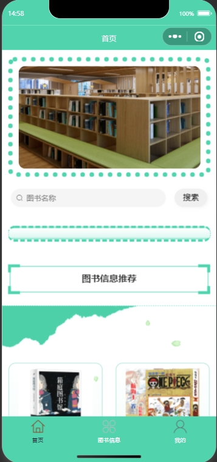
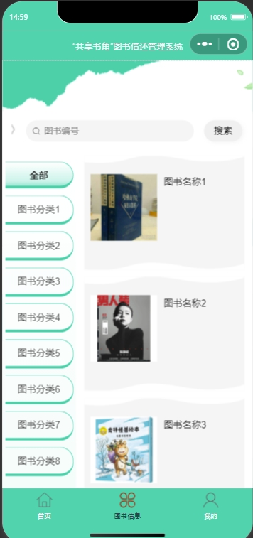
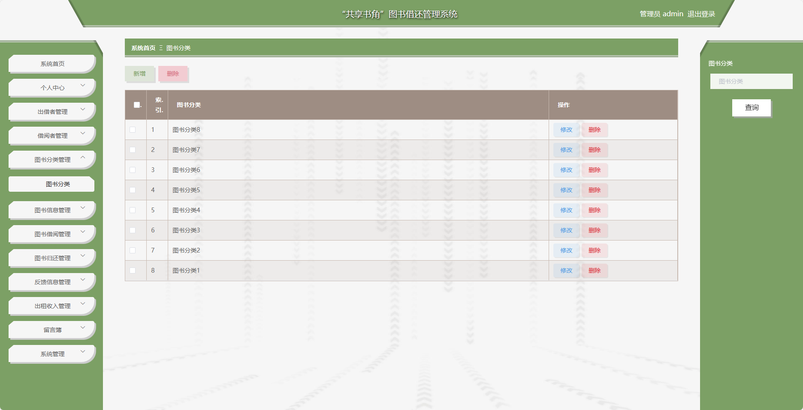
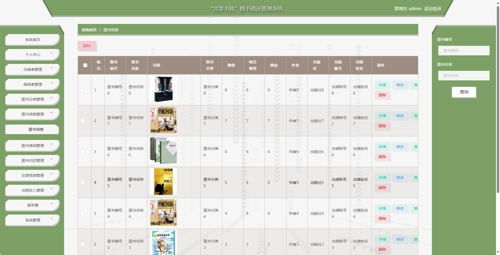
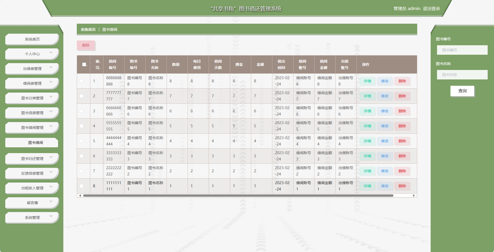
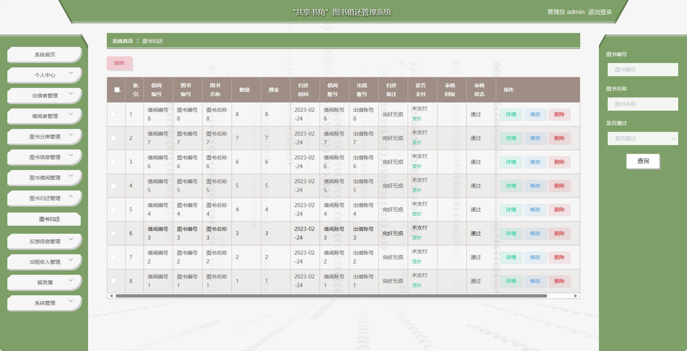
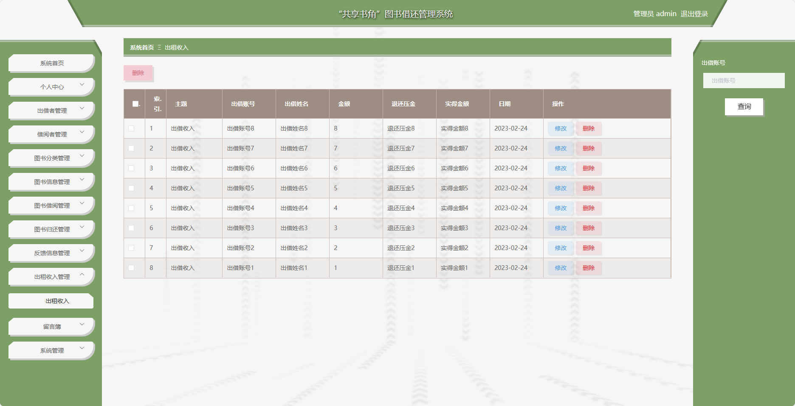

<h1 align="center">基于微信小程序+SSM的图书借还管理系统【带文档】</h1>

 获取sql文件 QQ: 3645296857 QQ群: 978300347 

<h4> 需要视频演示可联系上述QQ，私发视频链接 </h4>

 获取更多高质量源码，请访问：[mzoo源码网](https://mzoocodes.com/)

## 简介

> 本代码来源于网络,仅供学习参考使用!
>
> <b style="color: dodgerblue"> 提供1.远程部署/2.修改代码/3.定制程序/4.文档指导/5.框架代码讲解、技术解答、代码讲解等服务 </b>
>
> 前端地址：http://localhost:8080/springbootmbc21/admin/dist/index.html#/login
>
> 管理员: admin 密码: admin
>
> 出借者：出借账号1 密码：123456
>
> 借阅者：借阅账号1 密码：123456

## 项目介绍

基于微信小程序+SSM的图书借还管理系统【带文档】：前端 微信小程序、Vue、Axios，后端 SpringMvc、Mybatis，系统角色分为：管理员、出借者和借阅者，管理员在管理后台用户信息、图书出借以及归还情况、并对分类、反馈进行管理等；出借者可以发布自己的图书进行出借、查看自己的收入、并对书籍进行管理等；借阅者可以借阅书籍、归还、并且可以发布对系统的反馈等。主要功能如下：

### 管理员

- 基本功能: 登录、修改密码、修改个人信息
- 出借者管理: 获取出借者信息列表、添加出借者信息、删除出借者信息、修改出借者信息、查看出借者详情、查看出租收入、筛选出借者信息
- 借阅者管理: 获取借阅者信息列表、添加借阅者信息、删除借阅者信息、修改借阅者信息、查看借阅者详情、筛选借阅者信息
- 图书分类管理: 获取图书分类信息列表、新增图书分类信息、删除图书分类信息、筛选图书分类信息
- 图书信息管理：获取图书信息列表、删除图书信息、筛选图书信息、修改图书信息、查看图书评论、回复图书评论
- 图书借阅管理：获取图书借阅列表、删除图书借阅信息、筛选图书借阅信息、修改图书借阅信息、查看图书借阅详情
- 图书归还管理：获取图书归还列表、删除图书归还信息、筛选图书归还信息、修改图书归还信息、查看图书归还详情
- 反馈信息管理：获取反馈信息列表、删除反馈信息、筛选反馈信息、修改反馈信息、查看反馈信息详情
- 出租收入管理：获取出租收入信息列表、删除出租收入信息、筛选出租收入信息、修改出租收入信息
- 留言管理：获取留言列表、删除留言、筛选留言信息、修改留言信息、回复留言
- 轮播图管理：获取轮播图列表、修改轮播图信息、查看轮播图详情
- 图书资讯管理：获取图书资讯列表、修改图书资讯信息、查看图书资讯详情、新增图书资讯、删除图书资讯、筛选图书资讯信息

### 出借人

- 基本功能: 登录、修改密码、修改个人信息、注册、反馈、留言
- 图书信息管理：获取图书信息列表、删除图书信息、筛选图书信息、修改图书信息、查看图书评论、回复图书评论、推荐图书、获取图书分类列表
- 图书借阅管理：获取图书借阅列表、删除图书借阅信息、筛选图书借阅信息、查看图书借阅详情
- 图书归还管理：获取图书归还列表、删除图书归还信息、筛选图书归还信息、查看图书归还详情、审核
- 出租收入管理：获取出租收入信息列表、删除出租收入信息、筛选出租收入信息

### 借阅者

- 基本功能: 登录、修改密码、修改个人信息、注册
- 图书模块：获取图书列表、筛选图书信息、查看图书详情、收藏图书、点赞、拉踩、评论、借阅、归还
- 资讯模块：获取资讯列表、筛选资讯信息、查看资讯详情、

## 环境

- <b>IntelliJ IDEA 2020.3</b>

- <b>Mysql 5.7.26</b>

- <b>Maven 3.6.3</b>

- <b>JDK 1.8</b>

## 运行截图

